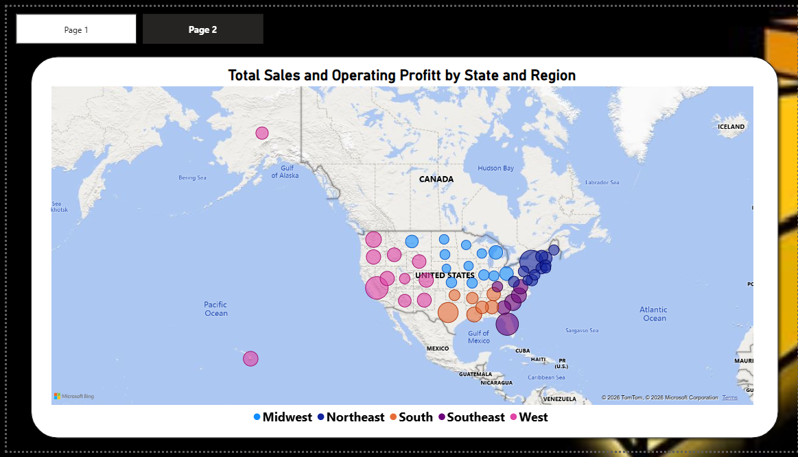

# Adidas-Sales-Analysis
This project presents an interactive Adidas US Sales Analysis Dashboard developed in Power BI. The dataset was cleaned and transformed using Power Query, followed by the creation of DAX measures and interactive visualizations to analyze sales performance, operating profit, product performance, regional trends, retailer performance, and sales methods. The dashboard enables users to explore key business metrics through dynamic filters and KPI cards, supporting data-driven decision-making.

### Project Overview

This project analyzes Adidas US sales performance using Power BI. The dataset was cleaned using Power Query, transformed into an analytical model, and visualized through an interactive dashboard that provides insights into sales, profitability, regional performance, product performance, and sales methods.

The dashboard is designed for business stakeholders to monitor key performance indicators and make informed decisions.

### Objectives

The primary objectives of this project are to:

- Analyze overall sales performance.
- Evaluate operating profit across regions.
- Identify top-selling products.
- Compare retailer performance.
- Analyze sales methods.
- Track sales trends over time.
- Provide an interactive dashboard for business users.

  ### Dataset Information

The dataset contains Adidas US sales transactions, including:

- Invoice Date
- Retailer
- Region
- State
- City
- Product
- Units Sold
- Price per Unit
- Total Sales
- Operating Profit
- Operating Margin
- Sales Method

  ### Data Cleaning (Power Query)

The following cleaning steps were performed:

- Removed duplicate records.
- Checked for missing values.
- Corrected data types.
- Converted Invoice Date to Date format.
- Converted monetary columns to Currency.
- Converted Operating Margin to Percentage.
- Renamed columns where necessary.
- Verified data consistency.

### Data Modeling

A single fact table was used because the dataset is already well structured.

Relationships were verified before creating visuals.

### DAX Measures

The following measures were created:

Total Sales = SUM('Sales'[Total Sales])

Operating Profit = SUM('Sales'[Operating Profit])

Units Sold = SUM('Sales'[Units Sold])

Profit Margin =
DIVIDE([Operating Profit],[Total Sales],0)

Total Products =
DISTINCTCOUNT('Sales'[Product])

Total Retailers =
DISTINCTCOUNT('Sales'[Retailer])

### Dashboard KPIs

The dashboard includes:

-Total Sales
- Operating Profit
- Units Sold
- Profit Margin
- Total Products

### Dashboard Visualizations

The report contains:

- KPI Cards
- Sales by Product
- Operating Profit by Region
- ⁠Sales by retail 
- Sales by Sales Method
- Sales Trend by Year
- Operating Profit by Region
- Interactive Slicers

### Business Insights

Some insights from the dashboard include:

- The West region generated the highest sales.
- Men’s Street Footwear is the highest-selling product.
- West Gear is the top-performing retailer.
- In-store sales contribute the largest share of revenue.
- Sales increased significantly from 2020 to 2021.

### Tools Used

- Microsoft Excel
- Power Query
- Power BI Desktop
- DAX
- GitHub

### Dashboard Preview

### Skills Demonstrated

- Data Cleaning
- Data Transformation
- Power Query
- DAX
- Data Modeling
- Dashboard Design
- Data Visualization
- Business Intelligence
- Analytical Thinking

### Conclusion

This dashboard provides a comprehensive view of Adidas US sales performance. Through interactive filtering and KPI tracking, it enables users to monitor business performance, identify trends, and support data-driven decision-making.
